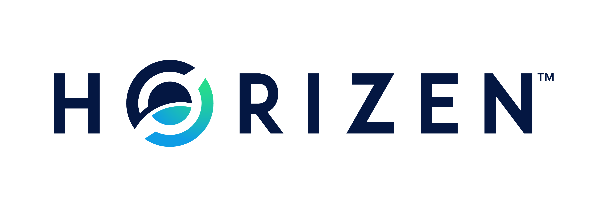

# ZenIP-42000

    ZenIP: 42000
    Title: ZenIP Process
    Owners: Jonas Rubel, <jonas@zensystem.io>
    Discussions-To: <jonas@zensystem.io>
    Comments-URI: https://horizen.global/invite/discord
    Status: Draft 
    Type: Process
    Created: 2019-09-05
    License: MIT

## Table of Contents

<!--ts-->
- [Terminology](#terminology)
- [Abstract](#abstract)
- [Motivation](#motivation)
- [Specification](#specification)
  * [ZenIP Workflow](#zenip-workflow)
    + [Reasons for Rejection of ZenIPs](#reasons-for-rejection-of-zenips)
    + [ZenIP Editors](#zenip-editors)
    + [Adding and Removing Editors](#adding-and-removing-editors)
    + [ZenIP Editors Responsibilities and Workflow](#zenip-editors-responsibilities-and-workflow)
    + [ZenIP Numbering Conventions](#zenip-numbering-conventions)
    + [Transferring ZenIP Ownership](#transferring-zenip-ownership)
  * [ZenIP Format and Structure](#zenip-format-and-structure)
    + [Overall Structure](#overall-structure)
    + [ZenIP Header Preamble](#zenip-header-preamble)
    + [Auxiliary Files](#auxiliary-files)
  * [ZenIP Types](#zenip-types)
  * [ZenIP Status](#zenip-status)
    + [Status Changes](#status-changes)
    + [Rationale](#rationale)
  * [ZenIP Comments](#zenip-comments)
    + [Discussion Tools](#discussion-tools)
    + [Discussion Summary](#discussion-summary)
  * [ZenIP Licensing](#zenip-licensing)
    + [Rationale](#rationale-1)
- [References](#references)
<!--te-->

## Terminology

The key words "MUST", "SHOULD", "SHOULD NOT", "MAY", "RECOMMENDED",
"OPTIONAL", and "REQUIRED" in this document are to be interpreted as
described in [RFC 2119](https://tools.ietf.org/html/rfc2119).

## Abstract

A Horizen Improvement Proposal (ZenIP) is a design document providing
information to the Horizen community, or describing a new feature for
Horizen or its processes or environment. The ZenIP should provide a
concise technical specification of the feature and a rationale for the
feature.

We intend ZenIPs to be the primary mechanism for proposing new features,
for collecting community input on an issue, and for documenting the
design decisions that have gone into Horizen. The Owner(s) of the ZenIP
(usually the authors(s)) are responsible for building consensus within
the community and documenting dissenting opinions.

Because the ZenIPs are maintained as text files in a versioned
repository, their revision history is the historical record of the
feature proposal.

This document is based on the work done by acityinohio, daira, and str4d
with [zip-0000](https://github.com/zcash/zips/blob/master/zip-0000.rst).
They themselves based their document partly on the work done by Luke
Dashjr with [BIP2](https://github.com/bitcoin/bips/blob/master/bip-0002.mediawiki).

## Motivation

It has been the stated goal of Horizen from the very beginning to build a decentralized platform, where not just the infrastructure is distributed, but also the funding and decision making. Part of the Horizen block subsidy goes to the Zen Blockchain Foundation treasury (at the time of writing - block 571074 - 20%), from where it gets distributed to fund the development of the protocol, the sidechain implementation, marketing as well as business development.

The ZenIP process will be an important step towards a decentralized decision making process for the Horizen ecosystem. Improvement Proposal processes have proven to work well for decentralized blockchain projects, hence it should be the best way to distribute influence and power towards the broader community of open source contributors and stakeholders.

## Specification

### ZenIP Workflow

The ZenIP process begins with a new idea for Horizen. Each potential
ZenIP must have an Owner - someone who writes the ZenIP using the style
and format described below, shepherds the discussions in the appropriate
forums, and attempts to build community consensus around the idea. The
ZenIP Owner should first attempt to ascertain whether the idea is
ZenIP-able. Small enhancements or patches to a particular piece of
software often don't require standardisation between multiple projects;
these don't need a ZenIP and should be injected into the relevant
project-specific development workflow with a patch submission to the
applicable issue tracker.

Additionally, some ideas might have been brought forward for changing Horizen
that have been rejected for various reasons. The first step should be to
search past discussions to see if an idea has been considered before,
and if so, what issues arose in its progression.

After investigating past work, the recommended way to proceed is by adding a dedicated channel
to the public [Discussion Tools](#discussion-tools).

Vetting an idea publicly before going as far as writing a ZenIP is meant
to save both the potential Owner and the wider community time. Asking
the Horizen community first if an idea is original helps prevent too
much time being spent on something that is guaranteed to be rejected
based on prior discussions (searching the internet does not always do
the trick). It also helps to make sure the idea is applicable to the
entire community and not just the Owner. Just because an idea sounds
good to the Owner does not mean it will work for most people in most
areas where Horizen is used.

To ask the community the Owner can start in our ZenIP Discord channel.
Once the Owner has asked the Horizen community as to whether an idea has
any chance of acceptance, a draft ZenIP should be presented to the
Horizen Community.

This gives the Owner a chance to flesh out the draft ZenIP to make it
properly formatted, of high quality, and to address additional concerns
about the proposal. Following a discussion, the proposal should be
submitted to the [ZenIP GitHub repository](https://github.com/ZencashOfficial/zenips) as a pull request. The draft
must be written in ZenIP style as described below, and have a descriptive
title such as `ZenIP-zentoshizenamoto-42millionzen` until the ZenIP
Editors (as defined herein) have assigned it a ZenIP number. Owners MUST NOT self-assign
ZenIP numbers. The ZenIP repository contains a [ZenIP Template](https://github.com/ZencashOfficial/ZenIPs/blob/master/zenip_template.md).

ZenIP Owners are responsible for collecting community feedback on both
the initial idea and the ZenIP before submitting it for review. Long open-ended discussions on forums should be
avoided wherever possible.

It is highly recommended that a single ZenIP contain a single key
proposal or new idea. The more focused the ZenIP, the more successful it
tends to be. If in doubt, split your ZenIP into several well-focused
ones.
When the ZenIP draft is complete, the ZenIP Editors will assign the
ZenIP a number according to the [ZenIP Numbering Conventions](#zenip-numbering-conventions), label it as Consensus, Standards Track, Informational, or Process, and merge the pull request to the ZenIPs git repository.

The ZenIP Editors will not unreasonably reject a ZenIP. [Reasons for the rejection of ZenIPs](#reasons-for-rejection-of-zenips) are specified in a dedicated section below.
For a ZenIP to be accepted it must meet certain minimum
criteria:

- It must adhere to the standards defined in this document.
- It must be a clear and complete description of the proposed
enhancement.
- The enhancement must represent a net improvement.

The ZenIP Owner may update the draft as necessary in the git repository.
Updates to drafts should also be submitted by the Owner as pull
requests.

#### Reasons for Rejection of ZenIPs

The ZenIP Editors MAY reject a proposed ZenIP or update to an existing
ZenIP for any of the following reasons:

-   it violates the Horizen [Code of Conduct](https://github.com/ZencashOfficial/zenips/blob/master/code_of_conduct.md);
-   the ZenIP does obvious harm to a group of people;
-   it violates applicable laws and regulations;
-   it appears too unfocused or broad;
-   it duplicates effort in other ZenIPs without sufficient technical justification
    (however, alternative proposals to address similar or overlapping problems
    are not excluded for this reason);
-   it has manifest security flaws (including being unrealistically dependent
    on user vigilance to avoid security weaknesses);
-   it disregards compatibility with the existing Horizen blockchain or ecosystem;
-   it is manifestly unimplementable;
-   it includes bugs in the code, pseudocode, or algorithms;
-   it contains incorrect information about its status
-   it is dependent on a patent that could potentially be an obstacle to
    adoption of the ZenIP;
-   it includes commercial advertising or spam;
-   it disregards formatting rules;
-   it makes non-editorial edits to previous entries in a ZenIP's Change history;
-   an update to an existing ZenIP extends or changes its scope to an extent
    that would be better handled as a separate ZenIP;
-   a new ZenIP has been proposed for a category that does not reflect its content,
    or an update would change a ZenIP to an inappropriate category;
-   it updates a Released ZenIP to Draft when the specification is already
    implemented and has been in common use;
-   it violates any specific "MUST" or "MUST NOT" rule in this document;
-   it is not authorized by the stated ZenIP Owners;
-   it removes an Owner without their consent (unless the reason for removal
    is directly related to a breach of the Code of Conduct by that Owner).

The ZenIP Editors MUST NOT unreasonably deny publication of a ZenIP
proposal or update that does not violate any of these criteria. If they
refuse a proposal or update, they MUST give an explanation of which of
the criteria were violated, with the exception that spam may be deleted
without an explanation.

Note that it is not the primary responsibility of the ZenIP Editors to
review proposals for security, correctness, or implementability.

Please send all ZenIP-related communications either by email to
<ZenIPs@horizen.global>, or by opening an issue on the [ZenIPs issue tracker](https://github.com/ZencashOfficial/zenips/issues). All communications should abide by the **Horizen Code of Conduct** and follow [the GNU Kind Communication Guidelines](https://www.gnu.org/philosophy/kind-communication.en.html)

#### ZenIP Editors

The current ZenIP Editors are:

- Peter Stewart, representing the Horizen Community Council and
- Jonas Rubel, representing the Zen Blockchain Foundation.
- Maurizio Binello, representing the Horizen Labs Company

Each organization has its own process for assigning its representative
editor. All can be reached at <ZenIPs@horizen.global>.

ZenIP Editors will have to make a number of decision and unanimity cannot be assumed and is not necessary for all kinds of decisions.
When we say *majority decision* this means more than half (>50%) of the Editors need to agree.
When we say *supermajority decision* this means more than two thirds (>66.6%) need to agree.
Additionally, there are decisions that require *unanimity*.

#### Adding and Removing Editors

Additional ZenIP Editors may be added by consensus among the current 
Editors. Our goal is to get benevolent organizations, institutions, or
individuals that demonstrate a willingness and capacity to significantly 
contribute to the ZenIP process involved as Editors. New Editors must be confirmed 
unanimously by all existing Editors.

Removing a ZenIP Editor must similarly be agreed upon unanimously by all Editors
except for the Editor in question.

#### ZenIP Editors Responsibilities and Workflow

The ZenIP Editors subscribe to the [Horizen - ZenIP Discussions](#discussion-tools)
as well as the ZenIP git repository.

For each new ZenIP that comes in a ZenIP Editor confirms the following:

-   Read the ZenIP to check if it is ready: sound and complete. The
    ideas must make technical sense, even if they don't seem likely to
    be accepted.
-   The title should accurately describe the content.
-   If the content is updated or changed the title must also be changed to reflect those changes.
-   The ZenIP draft must have been sent as a pull request to the ZenIP git repository.
-   Motivation and backward compatibility (when applicable) must be
    addressed.
-   ZenIPs must be licensed according to the [ZenIP licensing](#zenip-licensing) requirements set forth herein.

If the ZenIP isn't ready, a ZenIP Editor will send it back to the Owner for
revision, with specific instructions.

Once the ZenIP is ready for the repository it should be submitted as a
pull request to the ZenIPs GitHub repository where it may get
further feedback. It must not contain a ZenIP number, and should be
labelled "WIP" in the pull request.

The ZenIP Editors will:

-   Assign a ZenIP number in the pull request.
-   Merge the pull request when it is ready and remove the "WIP" label.

The ZenIP editors monitor ZenIP changes and update ZenIP headers as
appropriate.

#### ZenIP Numbering Conventions

The ZenIP Editors use the following conventions when numbering ZenIPs:

- All ZenIP numbers are prefixed with a 42 and followed by three digits. E.g. his very first ZenIP has the number 42000.
- If a ZenIP directly corresponds to a BIP (Bitcoin Improvement Proposal) or ZIP (Zcash Improvement Proposal), the same number is used, but without the prefix "42".
- Process and Informational ZenIPs will be assigned a number in the range 42000 to 42199
- Consensus ZenIPs will be assigned a number in the range 42200 to 42399
- Standard Track ZenIPs will be assigned a number in the range 42400 to 42599
- ZenIPs that should or will be deployed together will be numbered consecutively (wherever possible), and in a coherent reading order.

These conventions are subject to change by a *majority* decision of the Editors.

#### Transferring ZenIP Ownership

It occasionally becomes necessary to transfer ZenIPs to a
new Owner. In general, we'd like to retain the original Owner as a
co-Owner of the transferred ZenIP, but that's really up to the original
Owner. A good reason to transfer a ZenIP is because the original Owner
no longer has the time or interest in updating it or following through
with the ZenIP process, or has fallen off the face of the 'net (i.e. is
unreachable or not responding to email). A bad reason to transfer
a ZenIP is because you don't agree with the direction of the ZenIP. We
try to build consensus around a ZenIP, but if that's not possible, you
can always submit a competing ZenIP.

If you are interested in assuming control of a ZenIP, send a message
asking to take over, addressed to both the original Owner and the ZenIP
Editors. If the original Owner doesn't respond to email in a timely
manner, the ZenIP Editors will make a unilateral decision (it's not like
such decisions can't be reversed :).

If an author of a ZenIP is no longer an Owner, an Original-Authors field
SHOULD be added to the ZenIP header preamble indicating the original
authorship, unless the Original Author(s) request otherwise.

### ZenIP Format and Structure

The main purpose of this document is to define standards for how to propose protocol changes and new features.
Below you will find a specification of acceptable ZenIPs.

#### Overall Structure

ZenIPs SHOULD be written either in [GitHub Flavored Markdown](https://github.github.com/gfm/) or
[reStructuredText](http://docutils.sourceforge.net/rst.html).

Each ZenIP SHOULD have the following parts:

-   Preamble -- Headers containing metadata about the ZenIP ([see
    below](#ZenIP-header-preamble)). The License field of the preamble
    indicates the licensing terms, which MUST be acceptable according to
    [the ZenIP licensing requirements](#zenip-licensing).
-   Terminology -- Definitions of technical or non-obvious terms used in
    the document.
-   Abstract -- A short (\~200 word) description of the technical issue
    being addressed.
-   Motivation -- The motivation is critical for ZenIPs that want to
    change the Horizen protocol. It should clearly explain why the
    existing protocol is inadequate to address the problem that the
    ZenIP solves.
-   Specification -- The technical specification should describe the
    interface and semantics of any new feature. The specification should
    be detailed enough to allow competing, interoperable implementations
    for any of the current Horizen platforms.
-   Rationale -- The rationale fleshes out the specification by
    describing what motivated the design and why particular design
    decisions were made. It should describe alternate designs that were
    considered and related work. The rationale should provide evidence
    of consensus within the community and discuss important objections
    or concerns raised during discussion.
-   Security and privacy considerations -- If applicable, security and
    privacy considerations should be explicitly described, particularly
    if the ZenIP makes explicit trade-offs or assumptions. For guidance
    on this section consider [RFC3552](https://tools.ietf.org/html/rfc3552) as a starting point.
-   Reference implementation -- Literal code implementing the ZenIP's
    specification, and/or a link to the reference implementation of the
    ZenIP's specification. The reference implementation must be
    completed before any ZenIP is given status “Implemented”,
    but it generally need not be completed before the ZenIP is accepted
    into “Proposed”.

#### ZenIP Header Preamble

Each ZenIP must begin with an [RFC 822](https://www.ietf.org/rfc/rfc822.txt) style header preamble. The headers
must appear in the following order. Headers marked with "(\*)" are
optional and are described below. All other headers are required.

    ZenIP: ZenIP number ("X" before being assigned by the Editors)
    (*) Layer: Consensus (soft fork) | Consensus (hard fork) | Peer Services | API/RPC | Applications
    Title: ZenIP title; maximum 44 characters
    Owners: list of authors' names and email addresses
    (*) Discussions-To: email address
    (*) Comments-Summary: summary tone
    Comments-URI: links to ZenIP specific discussion
    Status: Draft | Active | Proposed | Rejected |
             Withdrawn | Final | Obsolete
    Type: Consensus | Standards Track | Informational | Process
    Created: date created on, in ISO 8601 (yyyy-mm-dd) format
    License: abbreviation for approved license(s)
    (*) License-Code: abbreviation for code under different approved license(s)
    (*) Post-History: dates of postings to **Horizen mailing list ?**, or link to thread in mailing list archive
    (*) Requires: ZenIP number(s)
    (*) Replaces: ZenIP number
    (*) Superseded-By: ZenIP number

The Owners header lists the names and email addresses of all the Owners
of the ZenIP. The format of the Owners header value SHOULD be:

    Random J. User <address@dom.ain>

If there are multiple Owners, each should be on a separate line.

While a ZenIP is in private discussions (usually during the initial
Draft phase), a Discussions-To header will indicate the URL where the
ZenIP is being discussed. No Discussions-To header is necessary if the
ZenIP is being discussed privately with the Owner.

The Category header specifies the type of ZenIP: Consensus, Standards
Track, Informational, or Process. The according GitHub label should also be used to indicate the type of ZenIP when a pull request is created.
The Created header records the date that the ZenIP was submitted.

#### Auxiliary Files

ZenIPs may include auxiliary files such as diagrams. Auxiliary files
should be included in a subdirectory for that ZenIP; that is, for any
ZenIP that requires more than one file, all of the files SHOULD be in a
subdirectory named ZenIP-42XXX.

Auxiliary files MUST be named ZenIP-42XXX-Y.ext, where "42XXX" is
the ZenIP number, "Y" is a serial number (starting at 1), and "ext" is
replaced by the actual file extension (e.g. "png").

### ZenIP Types

There are several types of ZenIP:

-   A Consensus ZenIP describes a change that affects the consensus
    protocol followed by all Horizen implementations.
-   A Standards Track ZenIP describes any non-consensus change that
    affects most or all Horizen implementations, such as a change to the
    network protocol, or any change or addition that affects the
    interoperability of applications using Horizen.

Consensus and Standards Track ZenIPs consist of two parts: a design
document and a reference implementation.

-   An Informational ZenIP describes Horizen design issues, or general
    guidelines or information for the Horizen community, that do not
    fall into either of the above categories. Informational ZenIPs do
    not necessarily represent a Horizen community consensus or
    recommendation, so users and implementers are free to ignore
    Informational ZenIPs or follow their advice.
-   A Process ZenIP describes a process surrounding Horizen, or proposes
    a change to (or an event in) a process. Process ZenIPs are like
    Standards Track ZenIPs but apply to areas other than the Horizen
    protocol itself. They may propose an implementation, but not to
    Horizen's codebase; they often require community consensus; unlike
    Informational ZenIPs, they are more than recommendations, and users
    are typically not free to ignore them. Examples include procedures,
    guidelines, changes to the decision-making process, and changes to
    the tools or environment used in Horizen development.
    This ZenIP-42000 is an example of a Process ZenIP.

New categories may be added by *majority consensus* among the ZenIP Editors.

### ZenIP Status

-   Draft: All initial ZenIP submissions have this status.
-   Withdrawn: If the Owner decides to remove the ZenIP from
    consideration by the community, they may set the status to
    Withdrawn.
-   Active: Typically only used for Process/Informational ZenIPs,
    achieved once rough consensus is reached in PR and/or the [discussion tool](#discussion-tools) on
    ZenIP Draft.
-   Proposed: Typically the stage after Draft, added to a ZenIP after
    consideration, feedback, and rough consensus from the community. The
    ZenIP Editors must validate this change before it is approved.
-   Rejected: The status when progress hasn't been made on the ZenIP in
    one year. Can revert back to Draft/Proposed if the Owner resumes
    work or resolves issues preventing consensus.
-   Implemented: When a Consensus or Standards Track ZenIP has a working
    reference implementation but before activation on the Horizen
    network.
-   Final: When a Consensus or Standards Track ZenIP is both implemented
    and activated on the Horizen network.
-   Obsolete: The status when a ZenIP is no longer relevant (typically
    when superseded or replaced by another ZenIP).

More details on the status workflow in the specification below.

#### Status Changes

A ZenIP may only change status from Draft (or Rejected) to Proposed,
when the Owner deems it is complete and there is rough consensus on the
forums, validated by the [ZenIP Editors](#zenip-editors). One Editor will not suffice -
there needs to be *supermajority* consensus among the ZenIP Editors.

ZenIPs should be changed from Draft or Proposed status, to Rejected
status, upon request by any person, if there has not been made any progress in
one year. Such a ZenIP may be changed to Draft status if the Owner
provides revisions that meaningfully address public criticism of the
proposal, or to Proposed status if it meets the criteria required as
described in the previous paragraph.

Owners of a ZenIP may decide on their own to change the status between
Draft and Withdrawn.

A Consensus or Standards Track ZenIP may only change status from Proposed to
Implemented once the Owner provides a reference implementation.

A Consensus or Standards Track ZenIP becomes Final when its associated
protocol change is activated on Horizen's mainnet.

A Process or Informational ZenIP may change status from Proposed to Active
when it achieves rough consensus on the forum or pull request. Such a proposal is
said to have rough consensus if it has been open to discussion for at least one month, and no person maintains any
unaddressed substantiated objections to it. Addressed or obstructive
objections may be ignored/overruled by general agreement of the ZenIP Editors that they have
been sufficiently addressed, but clear reasoning must be given in such
circumstances.

When an Active or Final ZenIP is no longer relevant, its status may be
changed to Obsolete. This change must also be objectively verifiable
and/or discussed. Final ZenIPs may be updated; the specification is
still in force but modified by another specified ZenIP or ZenIPs (check
the optional Updated-by header).

#### Rationale

We want to define unambiguous criteria for the Status field of ZenIPs, which has often been a source of confusion in similar improvement proposal processes. Many *X*-IPs with significant real-world use have been left as Draft or Proposed status longer than appropriate. By giving objective criteria to judge the progression of ZenIPs, this proposal aims to help keep the Status accurate and up-to-date.

This ZenIP does not aim to address what "should" be the basis of decisions. Such a statement, no matter how perfect in its justification, would be futile without some way to force others to use it. Opinions will always differ to some degree. The ZenIP process does not aim to be a kind of forceful "governance" of Horizen, merely to provide a collaborative repository for proposing and providing information on standards, which people may voluntarily adopt or not. It can only hope to achieve accuracy in regard to the "Status" field by striving to reflect the reality of *how things actually are*, rather than *how they should be*.

### ZenIP Comments

Here we define the platforms we want to use for the discussion of ZenIPs. This is important for the efficient communication and collaboration.
All discussions will be moderated according to the [Horizen Code of Conduct](https://github.com/ZencashOfficial/zenips/blob/master/code_of_conduct.md).

#### Discussion Tools

To vet an idea for a ZenIP publicly and to collect initial feedback the *ZenIP General* channel in our [Discord](https://discordapp.com/invite/Hu5mQxR) should be used.

Once a ZenIP is submitted as a pull request, comments from the community on ZenIPs should occur in the comment fields of the pull requests.
When the ZenIP Editors approve a pull request, assign it a number and the status changes to *Proposed* a dedicated channel in our Discord will be created for it.

ZenIPs may also choose to list a second forum for ZenIP comments. In this case, the second forum's URI should be listed below the primary place for discussion in the [Header Preamble](#zenip-header-preamble).

Each substantiated argument against the ZenIP should be addressed by the author.

#### Discussion Summary

After some time, the ZenIP itself may be updated with a summary tone of the comments. Summary tones may be chosen from the following, but this ZenIP does not intend to cover all possible nuances and other summaries may be used as needed:

- No comments yet.
- Unanimously Recommended for implementation
- Unanimously Discourage for implementation
- Mostly Recommended for implementation, with some Discouragement
- Mostly Discouraged for implementation, with some Recommendation

For example, the preamble to the ZenIP might be updated to include the line:

    Comments-Summary: No comments yet.
    Comments-URI: Horizen-Discussion-Tool/Comments:ZenIP-42000
    https://some-discussion-tool.org/ZenIP-42000-Comments

These fields must follow the "Discussions-To" header defined in [ZenIP Format and Structure](#zenip-format-and-structure) (if that header is not present, it should follow the position where it would be present; generally this is immediately above the Status header). To avoid doubt: comments and status are unrelated metrics to judge a ZenIP, and neither should be directly influencing the other.

Editors will use these sources to judge rough consensus. Reviews made prior to the completed version may be removed if they are no longer applicable and have not been updated in a timely manner (e.g. within one month).

### ZenIP Licensing

Each new ZenIP, including all documentation, modifications, additions and patent rights, shall be contributed pursuant to the Horizen Contributor License Agreement. Please review the terms therein before submitting a ZenIP.

Each new ZenIP MUST identify that it is being licensed  to Horizen under the MIT license.

In case a ZenIP includes modifications to an existing work that  is not licensed under the MIT license (a “Previous License”), the literal code included in the ZenIP may be dual-licensed - under the MIT license and the Previous License, if doing so is required by the Previous License. Each license MUST be referenced by its respective abbreviation given below.

For example, a preamble might include the following License header:

    License:    MIT
                GNU-All-Permissive

In this case, the ZenIP text is fully licensed under both the MIT license as well as the GNU All-Permissive License, and anyone may modify and redistribute the text provided they comply with the terms of either license. In other words, the license list is an "OR choice", not an "AND also" requirement.

The Previous License may not include any non-permissive licenses, commonly referred to as Copyleft licenses (i.e., any of the General Public Licenses). A ZenIP will not be accepted if the Previous License is non-permissive. This is not because the Horizen community is against Copyleft. It is simply the reality of how Horizen’s licensing scheme is constructed. Please review the Horizen Contributor License Agreement for more details.

#### Rationale

Licensing can be confusing in the open-source world. To save all people involved the headache, we decided to use a single license for all our open-source code and content. Nontheless, we don't want to prevent people from contributing, just because they don't agree with our choice of licensing. Hence, we are open to accepting contributions under different license terms, if compelling reasons are presented.

Please reach out to [ZenIP@horizen.global](mailto:zenip@horizen.global) in case you want to contribute but are unwilling to use the MIT license terms set forth herein. When compelling reasons are presented the ZenIP Editors may choose to add ZenIPs which are licensed differently, at their discretion.

## References

1.  The GNU Kind Communication Guidelines - https://www.gnu.org/philosophy/kind-communication.en.html
2.  RFC 7282: On Consensus and Humming in the IETF - https://tools.ietf.org/html/rfc7282
3.  Key words for use in RFCs to Indicate Requirement Levels - https://tools.ietf.org/html/rfc2119
4.  GitHub Flavored Markdown - https://github.github.com/gfm/
5.  reStructuredText - http://docutils.sourceforge.net/rst.html
