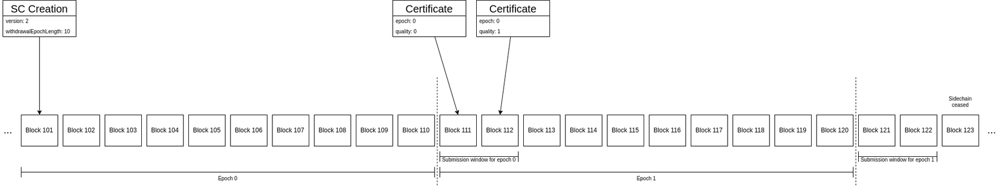

# ZenIP-42202

    ZenIP: 42202
    Title: Non-ceasable Sidechains
    Owner: Paolo Tagliaferri, <paolotagliaferri@horizenlabs.io>; cronic, <cronic@horizenlabs.io>
    Discussions-To: Paolo Tagliaferri, <paolotagliaferri@horizenlabs.io>
    Comments-URI: https://horizen.global/invite/discord
    Status: Draft
    Type: Consensus
    Created: 2022-08-01
    License: MIT

## Table of Contents

<!--ts-->

- [Abstract](#abstract)
- [Motivation](#motivation)
- [Specification](#specification)
  - [Constraints](#constraints)
  - [Maturity](#maturity)

## Abstract

This document introduces a new type of sidechain that never ceases from processing transactions. The version for this type of sidechains is “v2”.

With sidechains v0 and v1, all sidechains must specify a `withdrawalEpochLength` > 0 at time of creation, this value determines the length of the epoch and when a submission window opens and closes for each epoch. 

The life cycle of any sidechain is composed of epochs, that are sets of consecutive blocks whose size is determined by the `withdrawalEpochLength`. The first epoch begins with the block in which the sidechain is created (through a transaction containing its SidechainCreationOutput), the second one starts after `withdrawalEpochLength` blocks and so on.

At the beginning of any epoch, except for the first one, there is a subset of blocks that constitutes the so-called **submission window**, in which the sidechain is required to publish at least one certificate for the previous epoch. Any certificate received outside this window is automatically rejected.

Certificates act as an heartbeat of a sidechain and are the only way to move coins back to the mainchain.

If a sidechain doesn’t provide at least one certificate for an epoch, it is considered as “ceased” and no more transactions to and from the sidechain are accepted (only *Ceased Sidechain Withdrawals* are allowed as an emergency procedure to recover funds).

We propose to introduce sidechains v2 that are not required to submit certificates during a submission window but can continue to process transactions without the risk of ceasing.

Please note that this non-ceasing behavior is not enabled for all sidechains v2, but it must be explicitly requested by setting the `withdrawalEpochLength` to “0”.

Sidechains v2 will have two different behaviors based on the creation parameters:

- if the `withdrawalEpochLength` is set to “0”, the sidechain never ceases

- if the `withdrawalEpochLength` is not “0”, the sidechain works exactly as sidechains v1 (with normal ceasing behavior)

## Motivation

The sidechain mechanism that has been included in the Horizen blockchain under the name of “Zendoo“ was designed and implemented having in mind the security of users in a fully decentralized scenario.

There are some use cases where sidechains are implemented in a semi-centralized environment with relaxed security constraints.

In a fully decentralized sidechain, the `Mainchain Backward Transfer Request` (MBTR) guarantees to users the possibility to perform withdrawal of funds directly from mainchain in case the sidechain is somehow compromised (but continues to publish certificates). If the sidechain ceases, users can still retrieve their funds by using the `Ceased Sidechain Withrawal` (CSW) mechanism.

In semi-centralized environments, where users can trust the actors running the sidechain, those withdrawal mechanisms (MBTR and CSW) are not needed and users can rely on the normal Backward Transfer mechanism triggered on the sidechain itself. Moreover, in these environments, having fixed certificate submission windows may lead to unwanted or unexpected ceasing due to a variety of reasons:

- bugs in the software running the nodes

- connectivity issues

- congestion of blocks (too many transactions and certificates for one single block)

**Note**: The changes proposed in this ZenIP can mitigate such risks without affecting the security of the sidechain.

## Specification

The creation of sidechains v2 is triggered by the consensus rules starting with the activation of the fork point #10.

Any attempt to create a sidechain v2 on mainnet before that height will be rejected.

Sidechains v2 will keep all the features included in v1 in addition to the possibility to enable the non-ceasing behavior by properly setting the `withdrawalEpochLength`.

### Constraints

Sidechains v2 will never cease when setting `withdrawalEpochLength` to “0” at creation time. They are not forced to publish certificates during fixed submission windows. However, they can publish a certificate whenever they want, with the only two following constraints:

- The `epoch` values of certificates must be consecutive (i.e. after a certificate of epoch N the sidechain must publish a certificate of epoch N + 1)

- The `quality` mechanism is disabled, so it’s not possible to publish two or more certificates for the same epoch

These non-ceasable sidechains must satisfy the following constraints:

- **Sidechain Creation**

  - `withdrawalEpochLength` must be set to 0 (to disable the fixed-length epochs and submission windows, otherwise they work exactly as sidechains v1 do).

  - `mainchainBackwardTransferRequestDataLength` must be set to 0 (to disable the MBTR).

  - `wCeasedVk` must be empty (to disable the CSW).

- **Certificates**

  - The `quality` field must always be set to “0”.

  - If mainchain receives first a certificate of epoch N (either in mempool or in a block) and then another certificate of same epoch, the latter is rejected.

  - All certificates must refer (through the `endEpochCumScTxCommTreeRoot` field) to different ordered block. So, for instance, if the mainchain receives a certificate for epoch N referring to the mainchain block M (i.e. setting the `endEpochCumScTxCommTreeRoot `field to the same value specified in the header of the mainchain block M), any certificate coming next must refer to a `endEpochCumScTxCommTreeRoot` (and thus to a block) with higher height than M (M + 1, M + 2, etc., are all good candidates). Such constraint enforces that a certificate of higher epoch refers to a more updated state of the mainchain and of the sidechain.

  - More than one certificate for the same sidechain can be included in the same block (if they respect all the constraints above and are ordered sequentially).

When sidechains v2 are created with `withdrawalEpochLength` not set to 0, they will enable the default ceasing mechanism as it is intended for sidechains v1.

### Maturity

For sidechain v0 and v1, Zendoo implements a maturity mechanism for the amount of coins transferred to and from any sidechain.

For instance, whenever transactions are created with a cross-chain output (sidechain creation, forward transfer, or mainchain backward transfer request), the coins and fees are able to move to the sidechain but the amount is not immediately added to its balance. The coins are marked as immature and after some block confirmation, they are included in the sidechain balance. The number of confirmations is set to `10` blocks for mainnet in the chain parameters.
How is this concept of maturity handled by the mainchain? Whenever a transaction including a CSW or a certificate with BTs is received, the validation rules enforce that the total amount of coins moved back from sidechain to mainchain does not exceed the sidechain balance. If a sidechain tries to move back more coins than its balance, the transaction is rejected.

The concept of maturity also applies to backward transfers in a certificate. During the submission window phase, a certificate can be superseded by another certificate of higher quality. Because of this backward transfers included in a certificate are immature until the certificate is final.

If a sidechain ceases, any backward transfers in an immature certificate are reverted. Zendoo only considers backward transfers included in a top quality certificate for epoch N mature at the end of the submission window for epoch N + 1 (once a new certificate is submitted during the submission window of epoch N + 1).

Since non-ceasable sidechains don’t support CSW, the concept of maturity is unnecessary. Therefore, every cross-chain output or backward transfer is immediately considered spendable (and added/removed to the sidechain balance). This only applies to sidechains v2 with `withdrawalEpochLength` set to “0”.