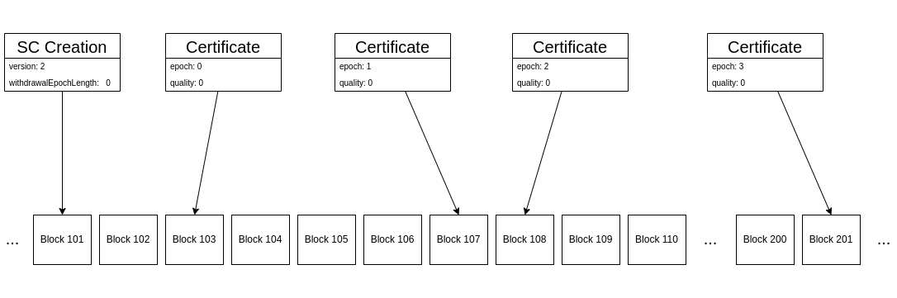

# ZenIP-42202

    ZenIP: 42202
    Title: Non-ceasable Sidechains
    Owner: Paolo Tagliaferri, <paolotagliaferri@horizenlabs.io>; cronic, <cronic@horizenlabs.io>
    Discussions-To: Paolo Tagliaferri, <paolotagliaferri@horizenlabs.io>
    Comments-URI: https://horizen.global/invite/discord
    Status: Draft
    Type: Consensus
    Created: 2022-08-01
    License: MIT

## Table of Contents

<!--ts-->

- [Abstract](#abstract)
- [Motivation](#motivation)
- [Specification](#specification)
  - [Constraints](#constraints)
  - [Maturity](#maturity)

## Abstract

This document introduces a new type of sidechain that never ceases from processing transactions. The version for this type of sidechains is “v2”.

For sidechains v0 and v1, a `withdrawalEpochLength > 0` must be specified at the time of creation. This value determines the length of the epoch and when a submission window opens and closes for each epoch. 

The life cycle of any sidechain is composed of epochs, which are sets of consecutive blocks whose size is defined by the `withdrawalEpochLength`. The first epoch begins with the block that creates the sidechain, the second epoch starts after a `withdrawalEpochLength` number of blocks, and so on.

At the beginning of every epoch (except for the first one), there is a subset of blocks that constitutes the **submission window**, during which the sidechain is required to publish at least one certificate for the previous epoch. Any certificate received outside this window is automatically rejected.

Certificates are the only way to move coins back to the mainchain.

If a sidechain doesn’t provide at least one certificate for an epoch, it is considered “ceased” and no more transactions to or from the sidechain are accepted. Only *Ceased Sidechain Withdrawals* are allowed as an emergency procedure to recover funds.

The proposal is to introduce sidechains v2 that are not required to submit certificates during a submission window and can continue to process transactions without the risk of ceasing.

This non-ceasing behavior is not enabled for all sidechains v2. It must be explicitly defined by setting the `withdrawalEpochLength` to “0”.

Sidechains v2 will have two different behaviors based on the creation parameters:

- if the `withdrawalEpochLength` is set to “0”, the sidechain never ceases

- if the `withdrawalEpochLength` is greater than “0”, the sidechain works exactly as sidechains v0 and v1 with ceasing behavior

## Motivation

The sidechain mechanism introduced in the Horizen blockchain with “Zendoo“ was designed and implemented for a fully decentralized scenario.

However, there are some use cases where sidechains are implemented in a semi-centralized environment with relaxed security constraints.

In a fully decentralized sidechain, the `Mainchain Backward Transfer Request` (MBTR) guarantees the withdrawal of funds directly from mainchain in case the sidechain is compromised (but continues to publish certificates). Additionally, if the sidechain ceases, funds can be withdrawn with the `Ceased Sidechain Withdrawal` (CSW). In a semi-centralized sidechain, however, MBTR and CSW are not necessary.

In semi-centralized environments, the actors running the sidechain can be trusted, and users can rely on the Backward Transfer mechanism triggered on the sidechain itself. Moreover, having fixed certificate submission windows may lead to unwanted or unexpected ceasing due to a variety of reasons:

- bugs in the software running the nodes

- connectivity issues

- congestion of blocks (too many transactions and certificates for one single block)

The proposed changes can mitigate such risks without affecting the security of the sidechain.

## Specification

The creation of sidechains v2 is triggered by the consensus rules starting with the activation of the fork point #10.

Any attempt to create a sidechain v2 on mainnet before that height will be rejected.

Sidechains v2 includes all the features in sidechains v1, and adds the possibility of enabling non-ceasing behavior by setting `withdrawalEpochLength = "0"`.

### Constraints

Sidechains v2 will never cease when setting `withdrawalEpochLength` to “0” at creation time. They are not forced to publish certificates during fixed submission windows. They can publish a certificate whenever they want, with the two following constraints:

- The `epoch` values of certificates must be consecutive (i.e. after a certificate of epoch N the sidechain must publish a certificate of epoch N + 1)

- The `quality` mechanism is disabled, so it’s not possible to publish two or more certificates for the same epoch

These non-ceasable sidechains must satisfy the following constraints:

- **Sidechain Creation**

  - `withdrawalEpochLength` must be set to 0. 
  This disables fixed-length epochs and submission windows.

  - `mainchainBackwardTransferRequestDataLength` must be set to 0. 
  This disables MBTR.

  - `wCeasedVk` must be empty. 
  This disables CSW.

- **Certificates**

  - If the mainchain first receives a certificate of epoch N (either in the mempool or in a block) and then receives another certificate in the same epoch N, the latter is rejected.

  - Any certificate of epoch N+1 must refer (through the `endEpochCumScTxCommTreeRoot` field) to a block that includes the certificate of epoch N in its *Sidechain Transactions Cumulative Commitment Tree*. So, for instance, if the mainchain receives a certificate for epoch N included in the mainchain block M, any certificate coming next must refer to a `endEpochCumScTxCommTreeRoot` (and thus to a block) with height equal or higher than M (M, M + 1, M + 2, etc., are all good candidates). Such constraint enforces that a certificate of higher epoch refers to a state of the mainchain that includes the previous certificate. The practical implications of this constraint are:
    - It's not possible to have more than one certificate in a block or in the mempool for a given non-ceasable sidechain.
    - Before starting the generation of the proof for a certificate of epoch N, the certificate of epoch N-1 must be already mined.

When sidechains v2 are created with `withdrawalEpochLength` not set to 0, they will enable the default ceasing mechanism as it is intended for sidechains v1.

### Maturity

For sidechain v0 and v1, Zendoo implements a maturity mechanism for the amount of coins transferred to and from any sidechain.

This means that whenever transactions are created with a cross-chain output (sidechain creation, forward transfer, or mainchain backward transfer request), the coins and fees are transferred to the sidechain but the amount is not immediately added to its balance. The coins are marked as immature, and only after some block confirmations, are they included in the sidechain balance. The number of confirmations is set to `10` blocks for mainnet in the chain parameters.
On the mainchain, whenever a transaction including a CSW or a certificate with BTs is received, the validation rules enforce that the total amount of coins transferred from sidechain to mainchain does not exceed the sidechain balance. If a sidechain tries to transfer more coins than its balance, the transaction is rejected.

The concept of maturity also applies to backward transfers in a certificate. During the submission window phase, a certificate can be superseded by another certificate of higher quality. Because of this backward transfers included in a certificate are immature until the certificate is final.

If a sidechain ceases, any backward transfers in an immature certificate are reverted. Zendoo only considers backward transfers included in a top-quality certificate for epoch N mature at the end of the submission window for epoch N + 1 (once a new certificate is submitted during the submission window of epoch N + 1).

Since non-ceasable sidechains don’t support CSW, the concept of maturity is unnecessary. This means that every cross-chain output or backward transfer is immediately considered spendable and it is immediately added to or removed from the sidechain balance.